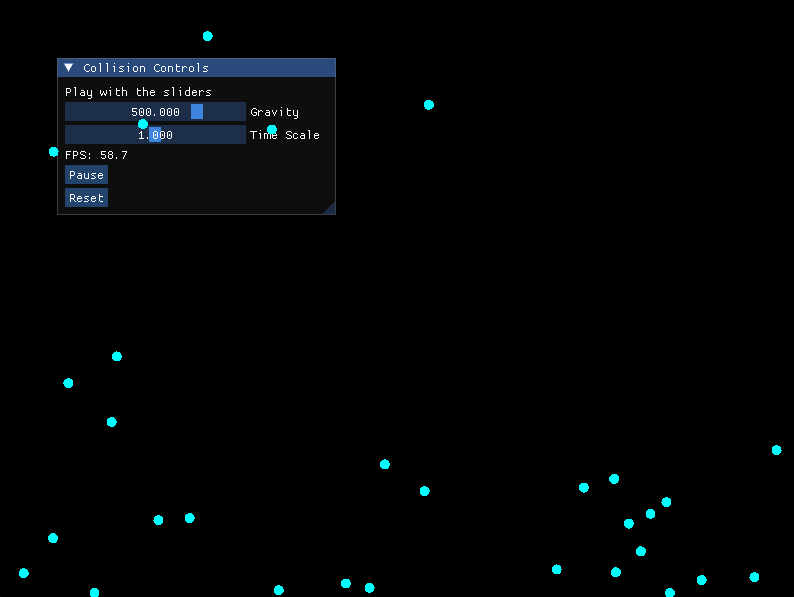

# Physics Simulator

> A performance-oriented 2D physics engine written in modern C++.

This project is a personal engineering laboratory focused on implementing physics simulations from scratch while exploring high-performance software engineering techniques.

## Current Simulations

### Collision Demo

A simple particle system featuring:

- Elastic collisions
- Gravity
- Wall constraints
- Overlap correction
- Frame-independent movement using delta time
- Randomized particle initialization
- Real-time rendering



## Build

### Requirements

- C++17
- CMake
- Ninja
- SFML 3
- Python 3
- ImGui-SFML

### Build commands:

**Debug build:**

```bash
python simulator.py debug
```

**Release build:**

```bash
python simulator.py release
```

**Run:**

```bash
python simulator.py run
```

**Clean:**

```bash
python simulator.py clean
```

**Rebuild:**

```bash
python simulator.py rebuild
```


## Repository Structure

```txt
project/
│
├── assets/          # Images, GIFs and resources
├── bin/             # Generated executables
├── build/           # CMake/Ninja build files
├── buildtools/      # Build system scripts
├── src/
├── CMakeLists.txt
├── simulator.py         # Build tool entry point
└── README.md
```

## Project Goals

This project is primarily a experimentation environment for understanding how physics engines and simulation systems work internally.

The purpose of this project is to explore:

- Physics engine architecture
- Collision detection algorithms
- Alternative integration methods
- Optimization techniques
- Spatial partitioning
- Real-time simulation systems
- Game physics fundamentals

The long-term goal is to progressively build more advanced systems from scratch instead of relying on existing physics engines.

Future planned features may include:

- Spatial hashing
- Quadtrees
- Different integrations
- Soft body simulation
- Multithreading experiments
